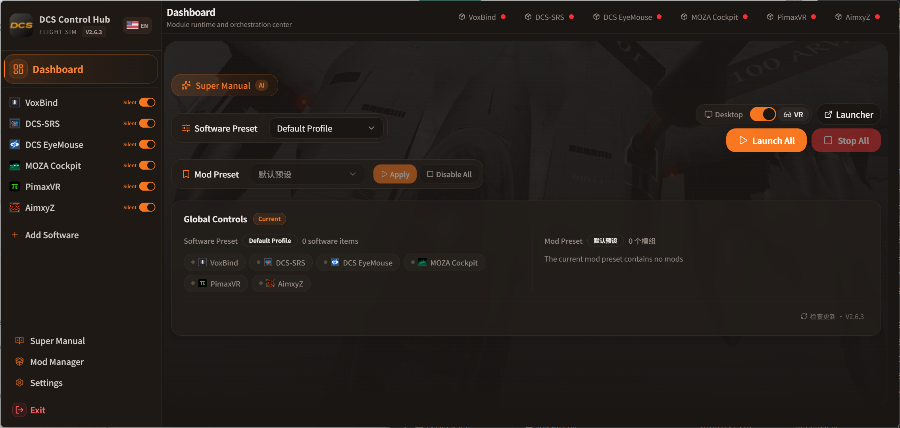
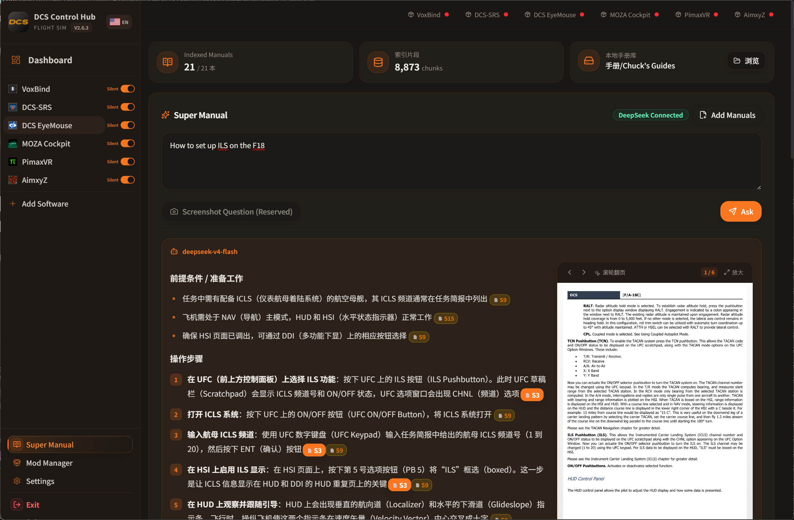
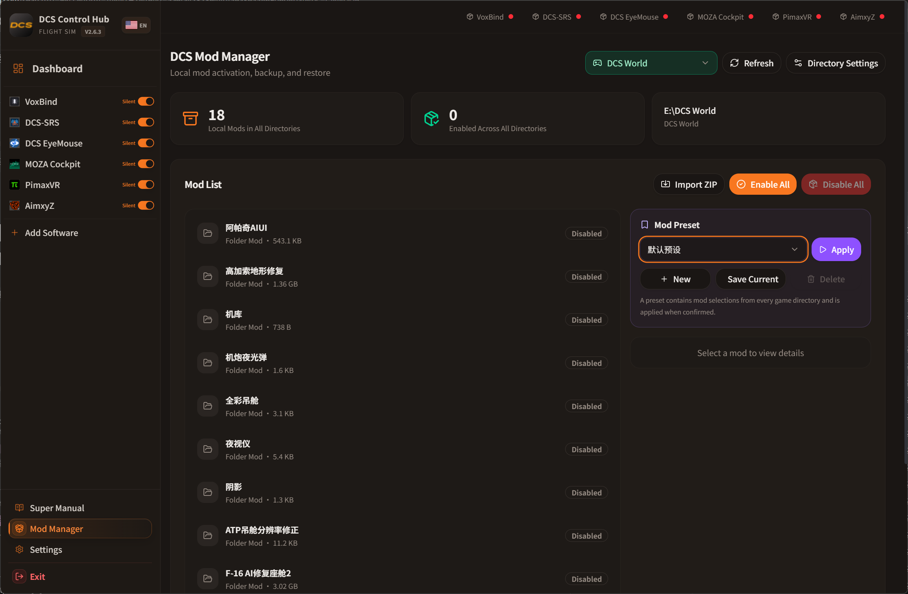

<div align="center">
  
  <h1>DCSHUB</h1>
  <p>面向 DCS World 玩家的一体化启动管理中心 · 超级手册 AI 问答 · 本地模组管理</p>
  <p>
    <a href="https://github.com/Jonitane/DCSHUB/releases/latest"><strong>⬇ 下载最新版 V2.0.3</strong></a>
    · <a href="https://github.com/Jonitane/DCSHUB/issues">反馈问题</a>
  </p>
</div>

## 界面预览

<p align="center">
  
  <br><em>仪表板 · 一键启动常用软件与模组预设</em>
</p>

<p align="center">
  
  <br><em>超级手册 · 基于本地手册库的 AI 问答，自动引用原文页码并裁切手册原图</em>
</p>

<p align="center">
  
  <br><em>模组管理器 · 多游戏目录支持、一键启停、文件级备份还原</em>
</p>

## 主要功能

### 🎮 软件启动与管理

- **软件预设**：勾选常用工具（SRS、VoxBind、EyeMouse、MOZA、PimaxVR、AimxyZ 等），一键补齐未启动项，重复点击不会重复拉起已运行的软件
- **内置驱动适配**：每个软件独立实现发现、启停、状态监控、窗口唤起和安全退出逻辑，不是简单的"打开 EXE"
- **静默启动**：对已适配软件自动使用托盘/最小化/隐藏方式启动，避免弹出一堆窗口
- **DCS 启动**：桌面/VR 模式一键切换，支持直接启动游戏或打开 DCS Launcher
- **自动识别**：自动搜索常见安装路径，也支持手动指定 EXE 或添加任意自定义软件
- **按需监控**：窗口失焦/最小化时暂停轮询，降低后台资源占用

### 📚 超级手册（本地 RAG 问答）

- 导入 PDF、DOCX、EPUB、HTML、Markdown、TXT、RTF 格式手册；支持拖拽添加
- 一键复制 DCS 安装目录中各模组的官方英文手册
- 内置 Chuck's Guides 批量下载，按机型选择或一次下载全部
- 三层独立索引（用户手册/DCS 官方/Chuck），长期复用，文件未变化不重复解析
- **严格机型隔离**：询问特定机型时绝不混用其他飞机的操作术语
- **结构化回答**：前提条件 → 操作步骤 → 常见问题/注意事项 → 速查总结，无废话
- 回答中嵌入对应页码的手册原页裁切图，点击可放大查看，支持页码跳转
- 每条操作标注来源编号 `[S1]`，可随时核对原文
- 联网搜索补充（基于 DeepSeek V4 Pro + Web Search），用于最新版本变更和社区资料
- API Key 使用 Windows 凭据安全加密存储

### 📦 本地模组管理器

- 支持多个 DCS 游戏目录，每个目录独立仓库互不干扰
- ZIP 模组一键导入，自动记录被替换文件，停用即还原
- 文件冲突检测与覆盖确认
- 全局模组预设，仪表板一键应用
- 一键停用全部模组
- `Saved Games\DCS\Config` 按键配置备份与恢复

### 🎨 界面体验

- 圆润橙黑主题，MiSans 字体，深色/亮色切换
- 中文/英文双语界面
- 响应式布局，适配不同窗口尺寸

## 已接入软件

| 模块 | 集成功能 |
| --- | --- |
| VoxBind | 主程序启停、窗口唤起、实时翻译开关、语音功能开关 |
| DCS-SRS | 读取服务器预设、连接/断开服务器、预警机浮窗 |
| DCS EyeMouse | "启动按键 + 双眨触发"模式、运行状态与自检日志 |
| MOZA Cockpit | 普通/静默启动、运行状态、打开原软件窗口、安全退出 |
| PimaxVR | Pimax Play 托盘启动；QuadViews 聚焦参数双向读写 |
| AimxyZ | 普通/静默启动、状态监控、打开窗口 |
| 自定义软件 | 自动读取名称/图标，普通/静默启动、状态监控、兼容性关闭兜底 |

> DCSHUB 是玩家社区独立项目，与 Eagle Dynamics、MOZA Racing、Pimax、VoxBind、DCS-SRS、AimxyZ 等厂商或项目无隶属、授权或背书关系。

## 下载安装

前往 [GitHub Releases](https://github.com/Jonitane/DCSHUB/releases/latest) 下载：

- `DCSHUB-2.0.3-portable.zip`：绿色便携版，解压后直接运行 `DCSHUB.exe`，无需安装
- `DCSHUB-<版本>-win-x64.exe`：Windows 安装版（CI 自动构建）

**首次使用**：

1. 启动后选择需要接入的内置软件
2. 进入「设置 → 软件路径与管理」点击"自动识别全部"，未识别的手动指定主程序
3. 在仪表板配置"软件预设"和"模组预设"
4. 如需使用超级手册，进入「设置 → 超级手册」配置手册库目录和 DeepSeek API Key

> 当前版本未进行商业代码签名，Windows 可能显示 SmartScreen 提示，请仅从本仓库 Releases 下载。

## 用户数据位置

用户设置保存在以下目录，升级绿色版时可按需备份：

```text
%APPDATA%\dcs-control-hub
```

DeepSeek API Key 以 Windows 当前用户凭据加密存储，无法直接复制到其他电脑解密。

## 开发

环境要求：Windows 10/11 x64、Node.js 20 LTS、npm。

```powershell
npm install
npm run dev          # 开发模式
npm test             # 集成测试
npm run typecheck    # 类型检查
npm run build        # 构建安装包和绿色版
```

源码结构：

```text
electron/
  builtins/         DCS 启动、软件目录、模组管理、超级手册核心服务
  integrations/     各软件 Driver 适配
  modules/          模块生命周期、状态、日志与调度
src/
  components/       通用界面组件
  pages/            仪表板、模组管理器、超级手册、设置
  shared/           Renderer/Preload/Main 共用类型契约
tests/              核心服务集成测试
public/             随程序发布的本地图片资源
docs/screenshots/   界面截图
```

## 参与反馈

- Bug 与功能建议：[GitHub Issues](https://github.com/Jonitane/DCSHUB/issues)
- 开发约定：[CONTRIBUTING.md](CONTRIBUTING.md)
- 安全问题：[SECURITY.md](SECURITY.md)

## 许可证

DCSHUB 自有源代码使用 [MIT License](LICENSE)。软件名称、商标、图标、截图及其他第三方素材归各自权利人所有，详见 [NOTICE.md](NOTICE.md)。
