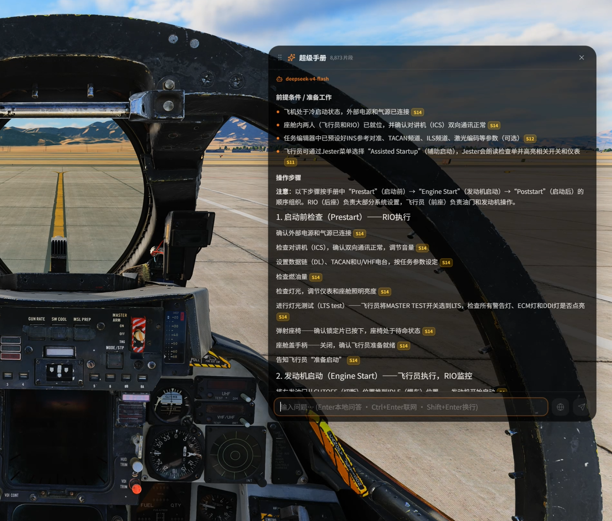

# DCSHUB

DCSHUB 是面向 DCS World 玩家的 Windows 桌面管理工具，用于统一启动飞行所需的软件、管理本地模组，并通过本地手册索引和可选 AI 服务提供可核对原文的问答能力。超级手册支持桌面与 OpenXR VR 浮窗，也可以使用本地语音识别直接提问。

当前正式版本：**V2.6.0**

下载地址：[GitHub Releases](https://github.com/Jonitane/DCSHUB/releases/latest)

问题反馈：[GitHub Issues](https://github.com/Jonitane/DCSHUB/issues)

## 项目定位

DCS World 玩家通常需要同时运行头显平台、外设驱动、语音通信、辅助输入和其他工具。DCSHUB 将这些软件集中到一个启动预设中，提供状态检查、静默启动、窗口唤起和一键停止能力；游戏模组、手册资料和 DCS 启动模式也可以在同一界面管理。

DCSHUB 是玩家社区独立项目，与 Eagle Dynamics 及所接入软件的厂商、作者或项目没有隶属、授权或背书关系。

## V2.6.0 更新重点

- **语音模型随安装包内置**：SenseVoice 安装后即可完全离线使用，不再要求用户访问 GitHub 下载或解压模型。
- **呼出键自由设置且不再独占**：支持单键、组合键、数字键盘键、常用标点键和游戏控制器按钮；键盘监听只旁听事件，前台程序仍会收到原按键。
- **用户数据改存安装目录**：设置、API 配置、手册索引与运行数据统一放在 `DCSHUB.exe` 同级 `data`，首次启动自动迁移旧配置。
- **V2.5.1 大版本能力全部保留**：原生 OpenXR VR 内置手册、本地语音输入、软件框架重构、超级手册 RAG 重构、检索提速以及 DeepSeek、千问、硅基流动 API 支持继续完善。
- **集中修复今日反馈**：覆盖模型下载失败、按键占用、TrackIR 冲突、长按误关、进程残留、引用图片定位、术语误识别、弱相关错误答案和成功判断排版等问题。

完整更新内容和升级说明见 [DCSHUB V2.6.0 更新说明](docs/releases/V2.6.0.md)。

## 界面预览

### 仪表板

软件预设、模组预设、桌面/VR 启动模式和 DCS 启动入口集中在同一页面。


### 超级手册

根据本地手册生成回答，保留来源编号、原文页码和对应页面图像。


### 本地模组管理器

支持多个 DCS 目录、独立本地仓库、全局模组预设以及文件备份和还原。


### 游戏内置手册窗口

同一套问答界面可在桌面或 OpenXR VR 环境中呼出。VR 面板固定在 LOCAL 空间，支持回中、拖动和原页查看。



## 主要功能

### 软件启动与管理

- 使用软件预设一键启动尚未运行的工具，避免重复拉起现有进程。
- 对内置模块提供路径发现、状态监控、窗口唤起和针对性的正常退出逻辑。
- 支持普通启动和静默启动；用户可为每个软件设置启动延迟。
- 支持添加任意本地软件，自动读取程序名称和图标。
- 支持桌面或 VR 模式启动 DCS，也可单独打开 DCS Launcher。
- DCSHUB 不在前台时降低状态检查频率，减少后台占用。

### 超级手册

- 支持 PDF、DOCX、EPUB、HTML、Markdown、TXT 和 RTF。
- 可以复制 DCS 安装目录中的官方英文手册，也可以下载 Chuck's Guides 或导入用户资料。
- 为用户手册、DCS 官方手册和 Chuck 手册维护可长期复用的本地索引；未变化的文件不会重复处理。
- 根据机型和资料来源进行严格路由，避免将其他机型的操作方法混入答案。
- 按真实 PDF 目录、章节子树、武器型号、工作模式和乘员席位组织检索，长流程会检查准备、设置、执行、反馈和限制是否完整。
- 使用证据约束的 AI 模型将专业原文整理为更易学习的步骤，同时保留控制项、数值、术语和来源编号。
- 回答可嵌入对应页的原图，支持放大、翻页和直接打开原手册位置。
- 本地问答与主动联网搜索结果均可持久缓存；相同问题优先读取缓存。
- 对无意义、缺少具体 DCS 主题或无法从手册核实的问题，不再用弱相关页面强行回答，而是提示使用联网搜索。
- 支持 DeepSeek、阿里云百炼千问和硅基流动；DeepSeek 与千问支持原生联网研究，硅基流动当前用于本地手册问答。
- API Key 使用 Windows 当前用户凭据加密保存。

### 桌面与 VR 内置窗口

- 桌面模式使用独立的可拖动浮窗，不覆盖整个显示器。
- VR 模式通过原生 OpenXR API Layer 将相同界面提交到头显。
- 每次呼出在当前视线方向建立 LOCAL 空间锚点，面板不会持续跟随头部移动。
- 呼出时自动去除头部 Roll 侧倾，使画布保持水平。
- 拖动面板时围绕呼出锚点做球面轨道运动，距离保持不变，面板持续朝向锚点。
- 桌面与 VR 分别记忆用户调整后的窗口尺寸，切换模式或重启后恢复各自大小。
- 右侧引用页面随答案阅读位置保持可见，支持滚轮切换引用页和点击放大。
- 快捷键采用非独占式全局按键边沿监听，DCSHUB 响应按下/松开事件的同时，原按键仍会继续传给当前程序；关闭后主动把焦点归还 DCS。
- 默认呼出键为 `Ctrl+Alt+M`；关闭内置手册功能时会卸载键盘监听，避免占用 TrackIR 的旧默认 `F9` 热键。

### 本地语音输入

语音识别在本地 .NET Core 中运行，SenseVoice 模型随安装包内置，不需要联网下载模型，也不会上传整段录音。

1. 在“设置 → 超级手册 → 内置手册窗口”选择麦克风并确认呼出键。
2. 短按手册呼出键显示或隐藏浮窗。
3. 长按呼出键说话，松开后系统会补录短暂尾音并开始识别。
4. 识别文字进入输入框后保留 1.6 秒修改时间；按 `Enter` 可立即发送，开始修改会取消自动提交。
5. 需要联网资料时，可修改文字后按 `Ctrl+Enter` 或点击联网搜索。

语音后处理与超级手册术语库共用机型、武器、传感器和航电缩写。常见误识别会自动归一，例如 `iPhone → F-14`、“节达姆/杰达姆”→ `JDAM`。

### 本地模组管理器

- 支持多个 DCS 游戏目录，每个目录拥有独立的本地模组仓库。
- 支持文件夹模组和 ZIP 导入、单个启停、全部启停及状态统计。
- 启用模组时记录被替换文件，停用时恢复原文件。
- 支持文件冲突检查和全局模组预设。
- 支持备份 `Saved Games\DCS\Config`，并显示上次备份时间。

### 更新策略

- 应用可以在启动时静默读取 GitHub Releases，但不会自动下载或安装。
- 只有发布说明中包含维护者推送标记的版本才会弹出更新通知。
- 日常提交和普通修复可以合并到仓库而不打扰现有用户。
- 用户可以在设置中关闭启动时更新检查。

## 已接入软件

| 软件 | 集成功能 |
| --- | --- |
| VoxBind | 主程序启停、窗口唤起、实时翻译和语音功能控制 |
| DCS-SRS | 读取服务器预设、连接或断开服务器、预警机浮窗 |
| DCS EyeMouse | 启动按键与双眨触发、运行状态和自检日志 |
| MOZA Cockpit | 普通或静默启动、状态监控、窗口唤起和正常退出 |
| PimaxVR | Pimax Play 启动；QuadViews 聚焦参数读写与应用 |
| AimxyZ | 普通或静默启动、状态监控和窗口唤起 |
| 用户软件 | 自动读取名称和图标，提供普通或静默启动及兼容性关闭兜底 |

## 安装与首次使用

系统要求：Windows 10/11 x64。

1. 从 [GitHub Releases](https://github.com/Jonitane/DCSHUB/releases/latest) 下载 Windows 安装程序。
2. 运行安装程序并选择安装目录。DCSHUB 为处理游戏目录、外部软件和 OpenXR 组件申请管理员权限。
3. 首次启动时选择需要接入的内置模块。
4. 在“设置 > 软件设置”中执行自动识别，并为未识别的软件手动选择主程序。
5. 在仪表板创建软件预设和模组预设，然后选择桌面或 VR 模式启动 DCS。
6. 如需使用超级手册，在设置中选择手册库目录，并配置 DeepSeek、阿里云百炼千问或硅基流动 API Key 与模型。
7. 如需语音输入，在内置手册窗口设置中选择麦克风并确认呼出键；SenseVoice 已包含在安装包中。

公开版本以安装版为准。绿色版仅用于本地开发调试，不作为正式分发方式。

当前版本未进行商业代码签名。Windows 可能显示 SmartScreen 提示，请只从本仓库 Releases 页面下载安装程序。

## 用户数据与隐私

程序设置、API 配置、手册索引和运行数据默认保存在：

```text
<DCSHUB 安装目录>\data
```

从旧版本首次升级时，DCSHUB 会从 `%APPDATA%\dcs-control-hub` 非覆盖迁移已有配置并保留旧目录作为回退。手册库、模组仓库和备份目录仍由用户自行选择。AI 服务 API Key 使用 Windows 当前用户凭据加密；DCSHUB 不提供公共密钥，也不会将用户手册上传到项目仓库。调用所选 AI 服务时只发送为当前问题检索出的相关文本；SenseVoice 语音识别在本地运行。

## 开发与验证

开发环境：Windows 10/11 x64、Node.js 20+、npm、.NET 10 SDK，以及构建 OpenXR 组件所需的 Visual Studio C++ 工具。

```powershell
npm install
npm run dev
npm run lint
npm test
npm run typecheck
npm run prepare:speech-model
npm run build
```

主要目录：

```text
electron/builtins/       DCS 启动、模组管理、超级手册、更新和 VR 服务
electron/core/           AppCore、独立 Core 客户端、事件总线和兼容降级
electron/integrations/   外部软件适配器
electron/modules/        模块生命周期、状态、日志和调度
core/                    .NET 10 协议层、Windows 平台层、Core Host 与测试
native/vr-overlay/       OpenXR API Layer、共享协议和帧桥接程序
src/components/          通用界面组件
src/pages/               仪表板、超级手册、模组管理器和设置页面
src/shared/              Main、Preload 与 Renderer 的共享类型契约
tests/                   核心服务集成测试
```

详细版本记录见 [CHANGELOG.md](CHANGELOG.md)，核心架构与后续 DCS/语音扩展边界见 [docs/ARCHITECTURE.md](docs/ARCHITECTURE.md)，V2.6.0 的完整说明见 [docs/releases/V2.6.0.md](docs/releases/V2.6.0.md)。

项目维护、账号迁移、发布流程、用户数据和已核实的重构建议见 [项目维护交接说明](docs/HANDOVER.md)。

## 参与项目

- 提交问题或建议：[GitHub Issues](https://github.com/Jonitane/DCSHUB/issues)
- 贡献代码：[CONTRIBUTING.md](CONTRIBUTING.md)
- 安全问题：[SECURITY.md](SECURITY.md)

## 许可证

DCSHUB 自有源代码使用 [MIT License](LICENSE)。软件名称、商标、截图和其他第三方素材归各自权利人所有，详见 [NOTICE.md](NOTICE.md)。
