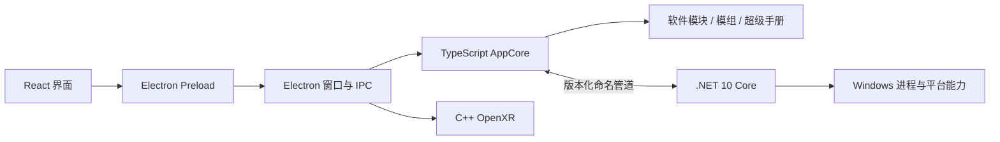

# DCSHUB 架构基线

## 总体结构

DCSHUB 使用“界面壳层 + 进程内应用核心 + 独立 Windows 核心 + 专用原生组件”的混合架构。每一层只承担自己擅长的职责，不为统一语言而重写已经稳定的能力。

## 各层职责

### React / Electron

- React 只负责界面和用户交互。
- Preload 提供受控、带类型的 IPC，不向页面暴露 Node.js。
- Electron 主进程负责窗口、系统对话框、全局快捷键和网页画面捕获。

### TypeScript AppCore

- 是 Electron 内业务服务的唯一组合根。
- 统一创建和释放软件模块、软件目录、模组管理、超级手册、DCS 启动、更新与 VR 服务。
- 统一转发模块状态、手册处理进度和独立 Core 事件。
- 保留依赖 Node.js PDF/索引生态的超级手册，避免无收益重写。

### .NET 10 Core

- 是自包含的单文件用户态进程，最终用户不需要安装 .NET。
- 运行在当前用户桌面会话，不注册为 Windows Service。
- 当前已经接管 DCS 进程监控，不再通过 Electron 周期性启动 `tasklist.exe`。
- 使用仅限当前用户的 Windows 命名管道，握手同时校验随机令牌、协议版本和父进程 PID。
- Electron 退出时由父进程监护自动退出；正常退出优先使用 `system.shutdown`。
- 连接断开时 Electron 自动切换到兼容监控并按退避间隔重连，界面不会被独立 Core 故障拖垮。

### C++ OpenXR

- OpenXR API Layer 与 VR 帧桥接继续使用 C++。
- 生命周期仍由 AppCore 和 Electron 窗口层控制。

## 通信协议

命名管道使用逐行 JSON，消息分为三类：

- `request`：带唯一 ID 的命令。
- `response`：与请求 ID 对应的成功结果或结构化错误。
- `event`：DCS 进程状态等由 Core 主动推送的事件。

协议当前为 V1，应用启动时必须先完成 `system.handshake`，其他命令在认证前一律不可调用。每个请求都有超时，消息缓冲区有大小上限。

## 开发与构建

- `global.json` 将开发 SDK 固定为 .NET `10.0.302`。
- `core/DcsHub.Core.slnx` 包含协议层、Windows 平台层、Host 与无第三方依赖的契约测试。
- `npm run build:core` 生成 `build/native/core/DcsHub.Core.Host.exe`。
- 开发模式、绿色版和安装版构建都会先生成 Core。
- Electron 打包会把 Core 放入 `resources/core`。
- GitHub CI 与 Release 工作流显式安装 .NET 10，避免开发机和云端使用不同 SDK。

## 可靠性与安全约束

- 独立 Core 只接受本机当前用户连接，不开放 TCP 端口。
- 命名管道名称和认证令牌每次启动随机生成，不写入用户配置。
- Core 只执行明确注册的命令，不接受任意 PowerShell、Lua 或文件路径操作。
- 日志写入 DCSHUB 安装目录下的 `logs/dcshub-core.log`。
- 第三方软件仍优先使用自身正常退出流程；架构切换不改变现有驱动行为。
