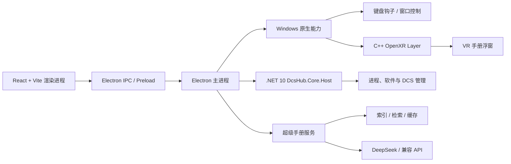
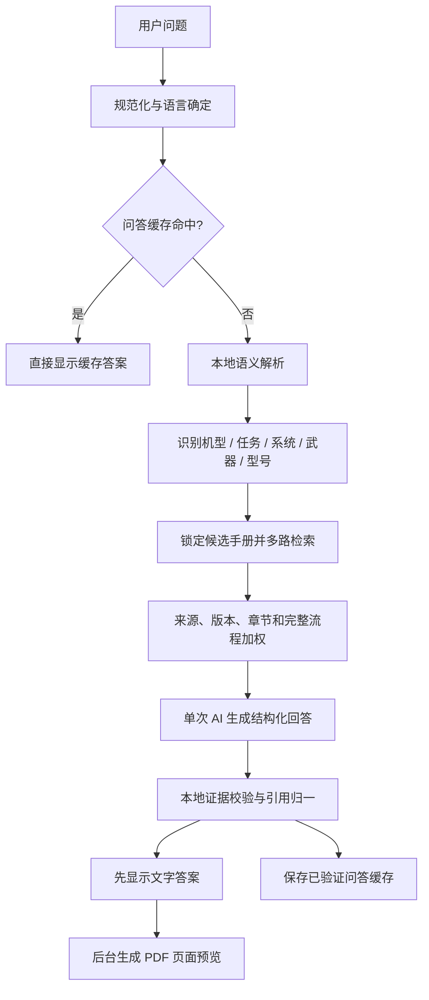

# DCSHUB 项目交接报告

> 更新时间：2026-07-23
> 用途：将本文件交给新的 Codex 会话，使其在不依赖旧对话上下文的情况下继续开发。
> 本文件描述的是当前本地工作区状态。除非用户明确要求，不得据此推送或合并 GitHub。

---

## 1. 首要规则

以下规则优先级最高，新会话开始工作前必须先确认：

1. 本地只保留两份内容：
   - 最新源码：`G:\AI\GPT\DCS\DCS HUB`
   - 调试绿色版：`G:\AI\GPT\DCS\DCSHUB-Debug-Portable`
2. 只有用户明确说“推送、合并、发布到 GitHub”时，才允许操作云端。
3. 增加新功能需要调整正式版本号；单纯修复 Bug 不调整正式版本号。
4. 每次业务代码改动都要：
   - 修改本地调试专用版本号。
   - 构建并同步到调试绿色版。
   - 把验证结果交给用户。
5. 不得清理、覆盖或回滚当前未提交改动。禁止使用：
   - `git reset --hard`
   - `git checkout --`
   - 未经确认的 `git clean`
6. 正式用户以后以安装版为主；绿色版仅用于本地调试。
7. 稳定性优先。不要为了“彻底关闭”软件而粗暴终止其全部服务或衍生进程，应优先模拟软件自身的正常退出流程。

---

## 2. 当前项目快照

| 项目 | 当前状态 |
|---|---|
| 源码目录 | `G:\AI\GPT\DCS\DCS HUB` |
| 调试绿色版 | `G:\AI\GPT\DCS\DCSHUB-Debug-Portable` |
| Git 分支 | `main` |
| 当前 HEAD | 以 `git log -1 --oneline` 为准 |
| Git 工作区 | V2.5.1 发布提交完成后应为清洁状态；仍需先运行 `git status --short` 确认 |
| `package.json` 版本 | `2.5.1` |
| 本地/正式显示版本 | `V2.5.1` |
| Electron | `43.2.0` |
| Windows 后端 | .NET 10 |
| VR 层 | 原生 C++ OpenXR API Layer |
| GitHub 仓库 | `https://github.com/Jonitane/DCSHUB` |

当前本地调试版已经完成过以下验证：

- `npm run typecheck` 通过。
- `npx tsc -p tsconfig.node.json` 通过。
- `npm run lint` 通过。
- `npm test` 的 11 个集成测试套件完整通过。
- `npm run build -- --publish never` 正式安装程序构建通过。
- `release\win-unpacked` 已同步到 `DCSHUB-Debug-Portable`。
- 实际启动调试绿色版后通过系统窗口关闭，目录下 Electron、Core Host、VR Bridge 均无残留进程。
- 最近一次确认的 `app.asar` SHA-256：
  `690E7D7E7539CCA395770E2D9D88B50C086B481F48C08E70074BED4087F2A24A`

V2.5.1 正式安装程序已在本地构建验证；公开发布由 `V2.5.1` 标签触发 GitHub Actions 完成。

---

## 3. 产品定位

DCSHUB 是面向 DCS World 玩家的一站式启动、管理、模组和手册工具。目标是减少玩家每次启动游戏时需要手动打开大量驱动、工具、插件和辅助软件的操作。

主要能力：

- 软件模块化接入。
- 软件预设与一键启动/停止。
- 桌面/VR 模式启动 DCS。
- 软件静默启动、普通启动、打开原窗口和正常退出。
- 本地 DCS 模组管理器。
- 多目录模组仓库与全局模组预设。
- SRS、VoxBind、EyeMouse、MOZA、Pimax、AimxyZ 等内置适配。
- 本地“超级手册”检索问答。
- 桌面与 VR 内置手册浮窗。
- 本地语音转文字提问。
- 用户可控的版本更新检查。
- 运行日志和问题诊断。

---

## 4. 总体架构



### 4.1 前端

- React
- TypeScript
- Vite
- Electron Renderer

关键目录：

- `src/pages`
- `src/components`
- `src/components/manual`
- `src/shared`

### 4.2 Electron 主进程

关键目录：

- `electron/main.ts`
- `electron/ipc`
- `electron/core`
- `electron/logging`
- `electron/native`
- `electron/platform`
- `electron/builtins`

职责：

- 窗口生命周期。
- IPC 注册。
- 软件启动/停止和窗口控制。
- DCS 启动。
- 更新检查。
- 日志。
- 超级手册服务。
- 键盘热键。
- VR Overlay 生命周期。

### 4.3 .NET 后端

目录：

- `core/DcsHub.Core`
- `core/DcsHub.Windows`
- `core/DcsHub.Core.Host`

目的：

- 将 Windows 原生业务能力逐步从巨大的 Electron 主进程中剥离。
- 提供更稳定、可测试、类型明确的进程和系统能力。
- 为未来语音、DCS 控制和复杂系统集成保留可扩展边界。

### 4.4 VR 原生层

目录：

- `native/vr-overlay`
- `electron/native`

采用 OpenXR 隐式 API Layer，把内置手册窗口作为 VR Overlay 注入。

---

## 5. 主要功能模块

### 5.1 软件管理

内置模块包括：

- VoxBind
  - 主程序。
  - 实时翻译。
  - 语音功能。
- DCS-SRS
  - 读取 SRS 内已有服务器预设。
  - 连接服务器。
  - 预警机浮窗。
- DCS EyeMouse
  - 保留原 GUI 的“启动按键 + 双眨触发”设置。
- MOZA Cockpit
  - 处理启动器/图片进程后再出现主程序的启动链。
- PimaxVR
  - PimaxPlay。
  - QuadViews Companion 的三个参数与 Apply。
- AimxyZ。
- 用户手动添加的软件。

每个软件支持的通用能力：

- 普通启动。
- 静默启动。
- 打开原窗口。
- 状态检测。
- 正常停止。
- 可配置 DCS 启动前延迟。
- 加入或移出软件预设。

### 5.2 启动与停止原则

必须区分：

- Hub 启动的进程。
- 用户在 Hub 外手动启动的进程。
- 主程序衍生的服务或子进程。

停止流程优先级：

1. 软件自己的托盘退出或关闭协议。
2. 正常窗口关闭消息。
3. 等待软件完成延迟退出。
4. 只对明确属于本次 Hub 启动实例的进程做有限兜底。

不得把“杀掉同名进程及其所有服务”作为默认停止方式。

### 5.3 一键启动

当前预期逻辑：

1. 读取当前软件预设。
2. 跳过已经运行的软件。
3. 按模块配置启动缺失的软件。
4. 遵守每个模块的延迟设置。
5. 最后启动 DCS。
6. DCS 已经运行时，也允许用户再次点击；系统应检查并处理 DCS 启动状态，而不是永久禁用按钮。

桌面/VR 选项只控制 DCS 与内置手册的运行模式。

---

## 6. 模组管理器

定位：替代 OvGME 的 DCS 本地模组管理功能，不做网络仓库和档案管理。

能力：

- 仅服务 DCS。
- 支持多个游戏目标目录。
- 每个目标目录有独立本地模组仓库。
- 汇总所有目录的本地模组和已启用模组。
- 模组预设跨目录保存全局选择。
- 仪表盘可以：
  - 选择模组预设。
  - 应用预设。
  - 关闭所有模组。
  - 单独启用或停用某个模组。
- 需要保护文件替换、冲突检测和恢复流程。
- “按键备份”用于备份 `Saved Games\DCS\Config`。
- 显示上次备份时间。

注意：模组启用/停用必须保证恢复文件可靠，不能因中途中止导致游戏目录处于半替换状态。

---

## 7. 超级手册

超级手册是目前最复杂、最需要谨慎修改的模块。

关键目录：

`electron/builtins/manual-library`

主要文件：

- `service.ts`：服务入口与主流程。
- `storage.ts`：手册、索引和缓存存储。
- `document-parser.ts`：PDF/文本解析。
- `source-classifier.ts`：来源、版本、语言和类型分类。
- `weapon-ontology.ts`：武器、别称、型号和语义。
- `answer-orchestrator.ts`：回答组织。
- `answer-style.ts`：回答结构和表达规范。
- `deepseek-client.ts`：AI 调用。
- `evidence-auditor.ts`：本地证据验证。
- `grounded-markdown.ts`：带引用回答处理。
- `preview-cache.ts`：PDF 页面预览。

共享 UI：

- `src/components/manual/ManualAnswerRenderer.tsx`
- 主页面和 Overlay 必须使用相同渲染逻辑，避免再次出现两套行为。

### 7.1 当前检索与回答流程



核心原则：

- 第一步应识别问题中的机型，再锁定对应手册。
- 用户不需要手动选择机型。
- 不再依赖“当前游戏机型识别”或“收藏机型”作为提问前提。
- 如果问题没有写具体武器型号，应按手册中存在的型号分场景回答。
- 如果用户明确写了型号，只回答该型号的流程，不得混入同系列其他型号。
- 回答允许 AI 做易读化、解释和结构整理，但关键事实与操作步骤必须来自手册证据。
- 不应退化成原文复制，也不能凭空补步骤。

### 7.2 回答结构规范

本地回答目标是达到在线答案的可读性，通常包括：

1. 简短功能说明。
2. 前提条件。
3. 操作说明。
4. 按场景或型号分支。
5. 成功表现或结果确认，仅在确实有必要且手册有依据时出现。
6. 注意事项。

应避免：

- 人格化教官开场白。
- 冗长重复。
- 把多条独立流程拼成流水账。
- 同一句后面附多个引用。
- 引用标签干扰正文排版。

当前要求：每条回答内容最多只保留一个最相关引用。

### 7.3 机型识别

需要处理常见简写和口语：

- F16、F-16、Viper。
- F18、F/A-18C、Hornet。
- F14、F-14A、F-14B、F-14B(U)。
- 阿帕奇、AH-64D。
- A10、A-10C、A-10C II。

F-14 特殊规则：

- F-14A、F-14B、F-14B(U) 当前共享同一本主手册。
- 如果未来出现独立 F-14B(U) 手册，应允许专用手册覆盖共享手册。
- 不能因为用户写 `F14BU` 就丢失 F-14 手册范围。

### 7.4 武器和型号语义

必须优先从已入库手册的目录、标题、章节和实体中生成能力范围，而不是无限堆硬编码。

需要正确处理：

- 不死鸟 → AIM-54。
- 宝石路 / Paveway → GBU 激光制导炸弹家族。
- 地狱火 → AGM-114，但 K/L 等型号必须分开说明。
- 小牛 → AGM-65，激光、IR、CCD/电视制导型号必须区分。
- HARM → AGM-88。
- JDAM → GBU-31/32/38/54 等，不同挂载与机型流程不可混用。

模糊问题处理：

- 用户只问武器家族时：列出当前机型与手册中实际存在的型号，再分型号回答。
- 用户明确型号时：只检索和回答该型号。
- 用户使用别称时：先归一到正式型号，再检索。

### 7.5 长流程完整性

冷启动、航电设置、武器使用、导航、着舰、空投等问题不能只命中一个局部章节。

检索必须覆盖：

- 目录/章节标题。
- 主流程连续页面。
- 前置设置。
- 操作步骤。
- 模式差异。
- 成功/状态提示。
- 限制与注意事项。

已暴露过的典型错误：

- F-14 冷启动只检索到 Jester 辅助流程，没有飞行员完整流程。
- F/A-18C 冷启动遗漏 GPS/INS 校准。
- F-14 CASE I/II/III 识别失败或输出错误章节。
- 用户只写武器家族时，把不同制导型号混为一套操作。

这些不是单个问题特判，而是“流程覆盖”和“实体分支”必须保留的通用要求。

### 7.6 CASE I / II / III

需要识别以下写法：

- `CASE1`、`CASE 1`、`CASE I`
- `CASE2`、`CASE 2`、`CASE II`
- `CASE3`、`CASE 3`、`CASE III`
- 中文“一级/二级/三级回收”“航母着舰”等。

回答必须维持统一结构，不能退化为无标题的 20 多步流水账。

### 7.7 手册来源分类与权重

顶层分类：

- 官方手册。
- Chuck 手册。
- 用户手册。

分类不能只看文件名，必须结合：

- 文档正文。
- 出版者与品牌。
- 页眉页脚。
- 版本号与修订日期。
- 语言。
- 是否为用户汉化版本。
- 是否为 DCS 全点击模组。

目标优先级：

1. Chuck。
2. DCS 官方全点击模组手册。
3. DCS 官方来源未完全确认的手册。
4. 用户手册/用户汉化。
5. DCS 官方非全点击模组手册。

当前大致权重约定：

- Chuck：400。
- DCS 官方全点击：300。
- DCS 官方未确认：250。
- 用户：200。
- DCS 官方非全点击：100。

权重不能替代相关性。错误机型或错误型号即使来源权重更高，也必须被排除。

### 7.8 本地问答中的 AI 角色

AI 负责：

- 理解用户的自然语言。
- 把手册证据整理为易学的操作说明。
- 识别问题可能包含的多个场景。
- 用用户界面所选语言回答。
- 生成规定的结构化结果。

本地代码负责：

- 机型和武器实体归一。
- 锁定手册范围。
- 检索和排序。
- 版本与来源优先级。
- 证据审计。
- 引用绑定。
- 缓存。
- PDF 预览。

原则：让 AI 负责“理解与表达”，让本地系统负责“范围、证据与可靠性”。

### 7.9 AI 调用

本地问答目标是一次 AI 调用完成回答，避免多阶段串行调用拉长等待时间。

在线搜索：

- 先在本地解析机型、武器和任务语义。
- 再进行一次联网搜索/生成请求。
- 已缓存的在线回答不重复调用 API。
- 当本地和在线都有相同问题的缓存时，优先展示在线缓存。

### 7.10 语言

回答语言已经改为跟随主页面语言选择：

- `zh-CN` → 中文回答。
- `en-US` → 英文回答。

不得再根据用户问题本身的语言自动决定回答语言。

API 形态：

- `ask(question, language?)`
- `askOnline(question, language?)`
- `preferredCachedAnswer(question, language?)`

缓存必须按语言隔离，避免中文页面命中英文答案。

### 7.11 证据验证

当前验证器需要兼容：

- 新版结构化 JSON。
- 旧缓存中的 `result` 包装。
- 字符串形式引用。
- 对象形式引用。
- 没有显式 `kind` 但引用有效的步骤。

验证器不应因为非关键格式差异丢弃整份有效答案。

当前检索管线版本：

- `RETRIEVAL_PIPELINE_VERSION = 'v39-carrier-case-structured-answer'`
- `ANSWER_CACHE_VERSION = 17`
- `ONLINE_ANSWER_CACHE_VERSION = 4`

修改检索、回答结构、证据规则或语义逻辑后，应升级相应缓存/管线版本，避免旧缓存掩盖修复。

### 7.12 PDF 预览

硬性要求：

- 文字答案先显示。
- PDF 图片在后台生成。
- 图片区域先显示加载占位。
- PDF 渲染失败不得阻塞或覆盖文字答案。
- 点击图片可放大。
- 放大层必须高于专注模式。
- 主窗口和桌面/VR 浮窗交互保持一致。

### 7.13 问答缓存

应包含：

- 本地已验证答案缓存。
- 联网答案缓存。
- PDF 预览缓存。
- 索引缓存。

设置中已有“一键清除问答缓存”入口。

缓存键至少应考虑：

- 规范化问题。
- UI 回答语言。
- 索引更新时间。
- 模型/供应商。
- 检索管线版本。

### 7.14 语音输入

采用 SenseVoice 本地语音转文字方案。

交互目标：

- 长按手册呼出键开始录音。
- 松开按键结束录音并自动提问。
- 松开后先收尾录音，识别完成保留 1.6 秒供用户修改或立即回车，再自动提问。
- 设置中可选择麦克风。
- 按键绑定兼容键盘和外设按钮。
- 语音识别结果进入与文字提问相同的语义归一和检索流程。
- DCS、航空、武器和军事术语应通过本地语义表纠正常见识别错误。

---

## 8. 桌面与 VR 内置手册

### 8.1 桌面浮窗

- 尺寸不能占满整个屏幕。
- 桌面与 VR 分别持久化用户拖动调整后的尺寸。
- 与 VR 浮窗使用相同回答渲染器。
- 支持文本输入、回车提问、图片查看、滚轮翻页和点击图片关闭。

### 8.2 VR 浮窗

当前目标行为：

- 使用 OpenXR Overlay。
- 呼出时出现在用户当前看向方向。
- 显示后固定在世界位置，不持续跟头移动。
- 鼠标拖动时围绕用户头部做弧形移动。
- 尽量减小歪头对画布旋转的影响。
- 不再需要单独回中键；重新呼出即按当前视线重新定位。
- 呼出和关闭需要防抖，当前目标间隔约 1 秒。

### 8.3 OpenXR 层清理

OpenXR 隐式层可能写入 HKCU/HKLM 注册表。如果软件异常退出，可能残留并影响其他 VR 软件。

所有生命周期路径都必须覆盖：

- 正常退出。
- 窗口关闭。
- DCS 退出。
- VR 模式关闭。
- Overlay 崩溃。
- 下一次 Hub 启动时的自检与残留清理。

---

## 9. 当前高风险问题

### 9.1 TrackIR 与全局键盘钩子冲突

已有用户从 2.15 升级到 2.22 后反馈：

- DCSHUB 运行时 TrackIR 失效。

最可能原因不是 OpenXR，而是全局低级键盘钩子：

- `electron/main.ts` 会启动全局键盘 Hook。
- 默认手册热键曾使用 F9。
- TrackIR 默认也使用 F9 暂停、F12 回中。
- 即使用户以桌面模式启动 DCS，Hook 仍可能在 Hub 启动时常驻。

相关文件：

- `electron/main.ts`
- `electron/native/windows/keyboard-hook.cs`

`V2.12.0-local.1` 已完成：

1. 只有用户启用内置手册热键时才安装 Hook，关闭功能会停止 Hook。
2. 旧默认 `F9` 自动迁移为 `Ctrl+Alt+M`，避开 TrackIR 默认键。
3. 短按/长按临界点增加释放保护，长按不再误触发窗口关闭。

仍需真实 TrackIR 用户验证；底层 Hook 当前仍会吞掉被绑定的目标键，因此用户主动绑定 TrackIR 正在使用的按键时仍可能产生冲突。

### 9.2 Git 工作区未提交改动较多

大量修改是当前开发成果，不能根据 HEAD 判断真实功能状态，也不能直接清理后重新实现。

新会话第一步应运行：

```powershell
git status --short
```

只用于了解状态，不得据此回滚。

### 9.3 超级手册服务仍然复杂

虽然已经拆出多个职责文件，但 `service.ts` 仍然较大。后续应继续逐步拆分，不要一次性重写：

- QueryAnalyzer。
- AircraftResolver。
- RetrievalPlanner。
- EvidenceAssembler。
- CacheCoordinator。
- PreviewCoordinator。

任何重构都必须先保留现有行为测试。

### 9.4 国际化技术债

当前部分中英文切换仍依赖页面文字替换机制。长期应迁移为正式 i18n 键值。

短期修复中不要同时大规模重写全部 UI 文案，否则风险过高。

### 9.5 日志链路

日志应覆盖：

- Electron 主进程异常。
- 渲染进程异常。
- .NET Core Host。
- OpenXR Overlay。
- 软件启动/停止。
- 全局键盘 Hook。
- 超级手册每阶段耗时。
- AI 请求错误与返回格式错误。
- 证据校验失败原因。

不得再出现大范围空 `catch`。至少记录 `warn`，同时避免把 API Key、用户隐私和完整敏感路径写入日志。

---

## 10. 数据、设置与日志

### 10.1 用户设置

主要用户数据位于：

`%APPDATA%\dcs-control-hub`

不同 Windows 用户首次运行时会创建独立配置。

可能包含：

- 软件路径。
- 软件预设。
- 模组目录与预设。
- 超级手册索引和缓存。
- UI 设置。
- 更新设置。
- Overlay 设置。

API Key 应通过 Electron `safeStorage` 保护，不得明文写日志。

### 10.2 日志

按当前产品要求，日志放在程序所在目录的 `logs` 下，常见文件：

- `dcshub.log`
- `dcshub-core.log`
- `openxr-overlay.log`

安装目录可能不可写，尤其是 `Program Files`。日志实现必须：

- 首选安装目录。
- 发现无写权限时明确记录并回退到用户可写目录。
- 不能因为日志创建失败导致主窗口打不开。

---

## 11. 设置页面约定

设置按大类折叠，避免卡片堆叠混乱。

### HUB 设置

- 主题。
- 记住主窗口位置和大小。
- 更新推送。
- 日志。
- 清理缓存/清除设置。

### 软件设置

- 软件预设。
- 软件路径与启动方式。
- 静默启动开关。
- DCS 启动前延迟。
- 软件启用/禁用。

“软件路径与启动”默认折叠。

### 超级手册设置

- API 供应商与 API Key。
- 本地问答模型。
- 在线搜索模型。
- 思考强度。
- 手册目录与添加手册。
- 麦克风。
- SenseVoice 模型。
- 桌面/VR 内置窗口。
- 呼出按键。
- 清除问答缓存。

已计划支持：

- DeepSeek。
- 硅基流动。
- Qwen/兼容 OpenAI API 的供应商。

DeepSeek 使用默认推荐配置时不必暴露过多模型细节。

---

## 12. 更新与发布策略

更新是否推送由用户决定。

- 日常小修可以提交云端，但默认不主动向用户弹窗。
- 用户明确指定某版本为可推送版本后，客户端才显示更新提示。
- 客户端设置中有更新检查开关。
- 启动时应静默检测，不应拖慢主窗口。
- 更新提示包含版本和变更说明。

正式发布：

- 以安装包为主。
- 安装包需要管理员权限，当前构建设置为 `requireAdministrator`。
- 大版本或大更新必须同时更新 GitHub 仓库首页 `README.md`，至少同步正式版本号、核心新功能、安装/使用方法、截图说明和当前支持的 API 服务；不能只更新 Release 正文与 `CHANGELOG.md`。
- 应尽量降低杀毒软件误报：
  - 代码签名。
  - 稳定的发布渠道。
  - 避免自解压壳和非常规进程注入。
  - 对 OpenXR、Hook 和窗口控制行为做明确说明。

除非用户明确要求，本地修复后不要：

- `git push`
- 合并 PR
- 创建 Tag
- 创建 GitHub Release

---

## 13. 构建与验证

在源码目录执行：

```powershell
Set-Location 'G:\AI\GPT\DCS\DCS HUB'
```

### 13.1 开发运行

```powershell
npm run dev
```

### 13.2 类型检查

```powershell
npm run typecheck
npx tsc -p tsconfig.electron.json --noEmit
```

### 13.3 测试

```powershell
npm test
```

项目包含的测试方向：

- Core architecture。
- Native bridge。
- DCS launch。
- Mod manager。
- Software catalog。
- SRS。
- i18n。
- Update。
- Logging。
- VR Overlay。
- Manual library。

修复局部问题时优先运行对应测试，不要每次无目的跑全部重型任务。

### 13.4 调试绿色版

```powershell
npm run build:debug-portable
```

构建完成后同步：

```powershell
Copy-Item `
  -Path 'G:\AI\GPT\DCS\DCS HUB\release\win-unpacked\*' `
  -Destination 'G:\AI\GPT\DCS\DCSHUB-Debug-Portable' `
  -Recurse `
  -Force
```

### 13.5 正式安装包

```powershell
npm run build
```

没有用户明确要求时，不要为普通 Bug 修复随意生成和发布正式安装包。

---

## 14. 版本规则

正式版本：

- 新功能：增加正式版本号。
- Bug 修复：正式版本号不变。

本地调试版本：

- 每次业务代码变动都增加 `-local.N`。
- 定义位置：`src/shared/app-meta.ts`。
- 示例：`V2.12.0-local.1` → `V2.12.0-local.2`。

不要只改界面显示而忘记构建产物中的版本元数据。

---

## 15. 最近完成的修改

最近本地版本重点处理：

1. 超级手册回答语言绑定主界面语言。
2. 本地与在线问答缓存按语言隔离。
3. 主页面和 Overlay 都传入当前 UI 语言。
4. 证据校验兼容旧缓存和不同引用结构。
5. 不再仅因步骤缺少 `kind` 字段而丢弃整份有效答案。
6. 每条正文最多显示一个引用。
7. CASE I/II/III、F-14 共享手册、武器型号等检索规则已经做过多轮修复。
8. PDF 页面预览采用答案优先、图片后台处理。
9. 桌面与 VR 内置膝板分别记忆尺寸，右侧引用图片随答案滚动保持可见。
10. SenseVoice 结果接入统一术语/缩写后处理，“节达姆”等会归一为 `JDAM`；无意义或过于抽象的问题提示使用联网搜索。
11. 旧默认手册热键从 `F9` 迁移到 `Ctrl+Alt+M`，关闭功能时卸载键盘 Hook。
12. 修复主窗口关闭后因隐藏 Overlay 存在而残留 Electron、Core Host 与 VR Bridge 的问题。
13. 修复旧 `result` 成功判断被错误转换成独立编号操作步骤的回归；完整手册集成测试恢复全绿。
14. 语音识别加入完整机型名称归一层，覆盖 `iPhone → F-14` 及常见中英文机型字母/数字拆读。

最近仍需用户验证的重点：

- 正确引用存在时，本地答案不应再被验证器清空。
- 中文界面问英文问题时仍应输出中文。
- 英文界面问中文问题时仍应输出英文。
- CASE I/II/III 能正确识别阿拉伯数字、罗马数字和无空格写法。
- 同系列武器未指定型号时分型号回答；指定型号时不混用。

---

## 16. 推荐的新会话起步流程

新会话不要从头重构，也不要先跑一堆任务。按以下顺序：

1. 完整阅读本交接报告。
2. 阅读用户当前最新问题。
3. 执行一次 `git status --short`，仅确认工作区。
4. 使用 `rg` 定位与当前问题直接相关的代码。
5. 先解释根因，再做最小范围修复。
6. 只运行与改动相关的类型检查或测试。
7. 修改本地调试版本号。
8. 构建并同步调试绿色版。
9. 告诉用户：
   - 修了什么。
   - 根因是什么。
   - 验证了什么。
   - 调试版启动路径。
10. 不推送 GitHub，除非用户明确要求。

---

## 17. 新会话可直接粘贴的提示词

```text
请继续维护我的 DCSHUB 项目。

源码：
G:\AI\GPT\DCS\DCS HUB

调试绿色版：
G:\AI\GPT\DCS\DCSHUB-Debug-Portable

请先完整阅读：
G:\AI\GPT\DCS\DCS HUB\docs\HANDOVER.md

必须遵守：
1. 不要清理或回滚当前 Git 未提交修改。
2. 只有我明确要求时才推送、合并或发布到 GitHub。
3. 新功能才改正式版本号，Bug 修复不改正式版本号。
4. 每次业务代码修改都增加本地 -local.N 版本号，并同步到调试绿色版。
5. 不要一开始跑全部任务；先定位当前问题，做最小范围检查与修复。

我现在要处理的问题是：
【在这里填写新的问题】
```

---

## 18. 交接结论

当前项目不是单纯的 Electron 启动器，而是由 React、Electron、.NET、Windows 原生能力、OpenXR 层、本地索引、AI 问答和语音识别共同组成的 Windows/DCS 平台。

后续开发最重要的原则：

- 保留现有行为，逐步重构。
- 本地证据约束与 AI 易读表达并重。
- 兼容 DCS、VR、TrackIR 和第三方软件。
- 少做问题特判，多从手册结构、实体、版本和流程覆盖解决通用问题。
- 先让用户验证本地调试版，再决定是否进入 GitHub 与正式发布流程。
